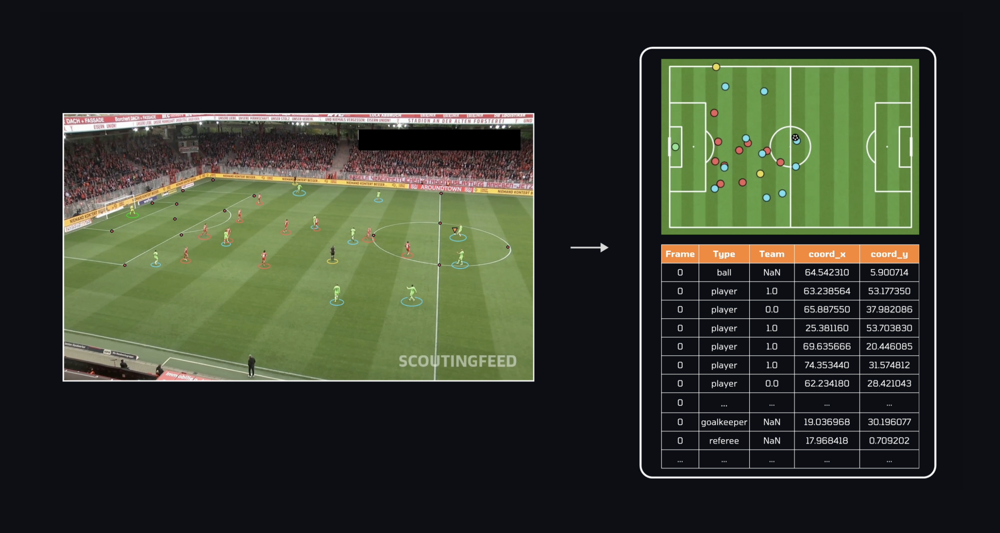

<!-------------------------------------------------------------------------------------->
<!-- REPO MAIN LIBRARIES -->
[![Python][python-shield]][python-url]
[![PyTorch][pytorch-shield]][pytorch-url]
[![Ultralytics][ultralytics-shield]][ultralytics-url]
[![OpenCV][opencv-shield]][opencv-url]

<!-------------------------------------------------------------------------------------->
<!-- PROJECT LOGO -->
<br />
<div align="center">
<h1 align="center">Pitch2Data</h1>
  <p align="center">
    A deep learning framework leveraging YOLO to transform football videos into data insights
    <br />
    <a href="./demo.py">View Demo</a>
    ·
    <a href="https://github.com/giuliofantuzzi/Pitch2Data/issues">Report Bug</a>
    ·
    <a href="https://github.com/giuliofantuzzi/Pitch2Data/issues">Request Feature</a>
    <br />
    <u>Authors:</u> <a href="https://github.com/giuliofantuzzi/">Giulio Fantuzzi</a> & <a href="https://github.com/valentinisalessio/">Valentinis Alessio</a>
</p>
</div>

|  |
|:------------------------------------------:|
<!-------------------------------------------------------------------------------------->
<!-- ABOUT THE PROJECT -->

## About the project
AI and data science are currently revolutioning football, from transfer market strategies to real-time match analysis and advanced probabilistic metrics (*I bet you have heard about Expected Goals!*). 

A key requirement for these tasks is **spatial data**, which is often difficult to obtain as it is mostly either private or accessible on a pay-per-demand basis. While professional teams may have access to GPS systems to track their players, what options are available for someone wanting to perform these analyses at home?

This project offers an accessible solution: a pipeline that extracts spatial data directly from raw football videos. Leveraging a deep learning framework based on the YOLO architecture and fine-tuned on football-specific datasets, this system detects players, the ball (with interpolation capabilities), and identifies key pitch points. Additionally, a TeamAssigner module automatically assigns detected players to their respective teams.
<!-------------------------------------------------------------------------------------->
<!-- ABOUT THE DATASETS -->

## About the dataset

Building a custom dataset for object detection requires a huge manual effort for bounding boxes annotation. In this context, it cames into help [Roboflow](https://github.com/roboflow): a platform that facilitates the dataset whole *creation-preprocessing-annotation* pipeline.

Roboflow offers a semi-automatic annotation tool that streamlines the entire process, along with easy-to-use Python APIs for seamless integration. Additionally, it provides access to a large collection of pre-existing public datasets for various computer vision tasks. For this project, we relied on 3 datasets:

- [Pitch Detections](https://universe.roboflow.com/roboflow-jvuqo/football-players-detection-3zvbc/dataset/11) (for detection of players, goalkeepers and referees);
- [Ball Detection](https://universe.roboflow.com/roboflow-jvuqo/football-ball-detection-rejhg/dataset/2) (for detection of the ball);
- [Pitch Keypoints Detection](https://universe.roboflow.com/roboflow-jvuqo/football-field-detection-f07vi/dataset/15) (for detection of pitch keypoints)

> [!WARNING]
> All the datasets were built on frames from the [DFL - Bundesliga Data Shootout](https://www.kaggle.com/datasets/alejopaullier/dfl-clips) Kaggle competition. This choice impacts performance, particularly because all clips were captured with wide-angle cameras. Consequently, applying the model to standard highlight views may result in reduced performance due to the significant difference in perspective.

> [!NOTE]
> With a bit of manual effort, the dataset can be augmented to enhance its representativeness. We are confident that retraining the model with this augmented dataset will significantly improve performance when applied to standard highlight video perspectives.

<!-------------------------------------------------------------------------------------->

<!-- INSTALLATION & SETUP -->

## Installation & Setup

To get started, first clone the repository (you may also want to fork it):

```bash
git clone https://github.com/giuliofantuzzi/Pitch2Data.git
```
> [!WARNING]
> The command above will download the full repository, including all the pre-trained weights. <u>If you prefer a faster download</u> without the weights, <u>clone the *light-setup branch*</u> by executing:
>  ```bash
>  git clone https://github.com/giuliofantuzzi/Pitch2Data.git --branch light-setup --single-branch --depth 1
>  ```


Next, install the required dependencies

```bash
pip install -r requirements.txt
```

Then, set up the environment by executing:

```bash
sh setup.sh
```

<!-------------------------------------------------------------------------------------->

<!-- DEMO -->

## Demo

You can download sample videos directly from the terminal using the following command:

```bash
python download_videos.py
```

To run the demo, execute:

```bash
python demo.py <YOUR_VIDEO_NAME> --[options] 
```
To know more about the options (<u>**STRONGLY SUGGESTED**</u>):

```bash
python demo.py --help
```

> [!NOTE]
> If you have cloned the *light-setup*, you will need to fine-tune the model on your own. To do so, you can use the notebooks provided in the [`tuning/`](tuning/) folder. 
<!-------------------------------------------------------------------------------------->

<!-- SHIELDS and URLS -->
[forks-shield]: https://img.shields.io/github/forks/giuliofantuzzi/Pitch2Data.svg?style=for-the-badge
[forks-url]: https://github.com/giuliofantuzzi/Pitch2Data/network/members
[stars-shield]: https://img.shields.io/github/stars/giuliofantuzzi/Pitch2Data.svg?style=for-the-badge
[stars-url]: https://github.com/giuliofantuzzi/Pitch2Data/stargazers
[issues-shield]: https://img.shields.io/github/issues/giuliofantuzzi/Pitch2Data.svg?style=for-the-badge
[issues-url]: https://github.com/giuliofantuzzi/parallel-quicksort-algorithms/issues
[python-shield]: https://img.shields.io/badge/Python-Python?style=for-the-badge&logo=Python&logoColor=%23FECC00&color=%233776AB
[python-url]: https://www.python.org/
[pytorch-shield]: https://img.shields.io/badge/PyTorch-PyTorch?style=for-the-badge&logo=PyTorch&logoColor=white&color=orange
[pytorch-url]: https://www.pytorch.org/
[opencv-shield]: https://img.shields.io/badge/OpenCV-OpenCV?style=for-the-badge&logo=OpenCV&logoColor=white&color=%46E770
[opencv-url]: https://www.opencv.org/
[ultralytics-shield]: https://img.shields.io/badge/Ultralytics-Ultralytics?style=for-the-badge&logo=Ultralytics&logoColor=white&color=darkviolet
[ultralytics-url]: https://www.ultralytics.com/

<!-------------------------------------------------------------------------------------->


